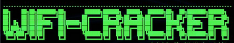
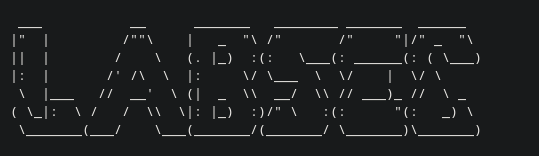
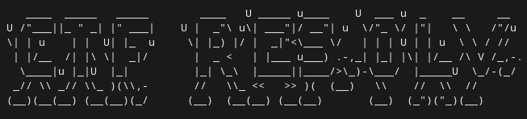

# 🧩 Trabajos de Nuestra Comunidad

¡Bienvenidos al repositorio oficial de los trabajos realizados por los miembros de nuestra comunidad!  
Aquí encontrarás proyectos colaborativos, contribuciones individuales y material educativo creado con esfuerzo y pasión.

---

## 🌟 Sobre Nosotros

Somos una comunidad comprometida con el aprendizaje, la creatividad y la colaboración. Este espacio tiene como objetivo dar visibilidad a nuestras iniciativas, compartir conocimientos y fomentar la participación de todos.

---

## 📌 Trabajos

### 🔹 Apeiron

> Secuestro de handshake y Rogue AP.

---

### 🔹 Joao

> LabSec: Laboratorio de Seguridad Ofensiva y Análisis Educativo

### 🔹 Juan

> 

---

### 🔹 Guerreros

> CTF:resolv machine for Dokerlabs (DATABASE-MEDIUM)
---

## 📝 Cómo Contribuir

1. **Fork** del repositorio.
2. Crea tu carpeta dentro de la sección correspondiente (`individuales` o `proyectos_colaborativos`).
3. Añade tus archivos y documentación (puede incluir PDF, imágenes, código, etc.).
4. Haz un **Pull Request** con una breve descripción de tu aporte.

> 💡 Si necesitas ayuda, no dudes en abrir un issue o preguntar en nuestro grupo.

---

## 🎉 Créditos

Gracias a todos los miembros que día a día aportan con su creatividad y esfuerzo.

---

## 📬 Contacto

¿Tienes dudas o sugerencias? Escríbenos a: [byte-0-community@proton.me](byte-0-community@proton.me)  

---

**¡Tu trabajo importa, y aquí lo celebramos juntos!**
